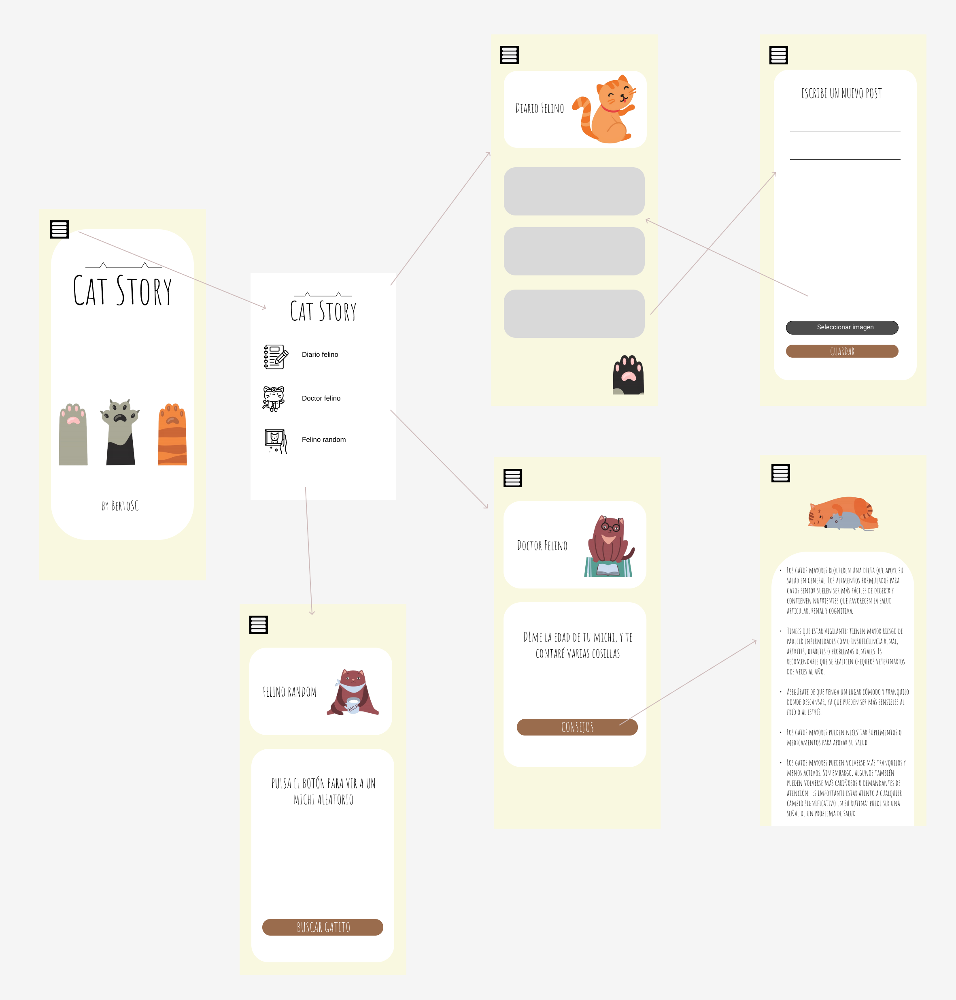

# Diseño 

View Binding: implantación para simplificar el acceso a los componentes de la vista.

View Model: el principal esquema de diseño de la APP se basa en el patrón VMVM. En este caso, el esquema refleja la interacción entre las dataclasses, las vistas y la clase View Model que contendrá la lógica básica de manejo de datos y su actualización y observación en coordinación con Live Data.

Live Data: establecimiento de observadores para controlar los cambios de datos y actualizar la vista en base a ello.

Recycler View: uso de RV para la implementación de la funcionalidad básica de la APP (el diario). Para ello, se crea una DataClass correspondiente que reflejará el item de cada entrada de diario, además de un adaptador que permitirá vincular los datos con las vistas. 

Retrofit: creación de las clases para permitir el acceso y recuperación de datos del repositorio CatAPI, creando un cliente, la interfaz para implementar el servicio y la DataClass que servirá de molde para la recuperación de datos (en formato JSON).

Persistencia: implementación de la persistencia en la aplicación mediante sistema de archivos en formato JSON, que guardará y recuperará las diferentes entradas de diario que cree el usuario gracias a los métodos establecidos en el VM correspondiente. 

Interacción con el SO: parte de las funcionalidades de la APP requieren de permisos y objetos específicos para interactuar con el Sistema Operativo del teléfono, como el uso de ImagePicker e Intent para poder realizar las peticiones y acciones como "seleccionar imagen de la Galería del teléfono". 

## Navegación 

